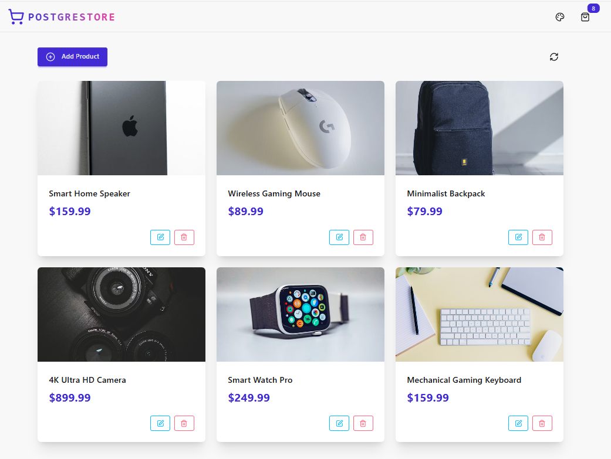
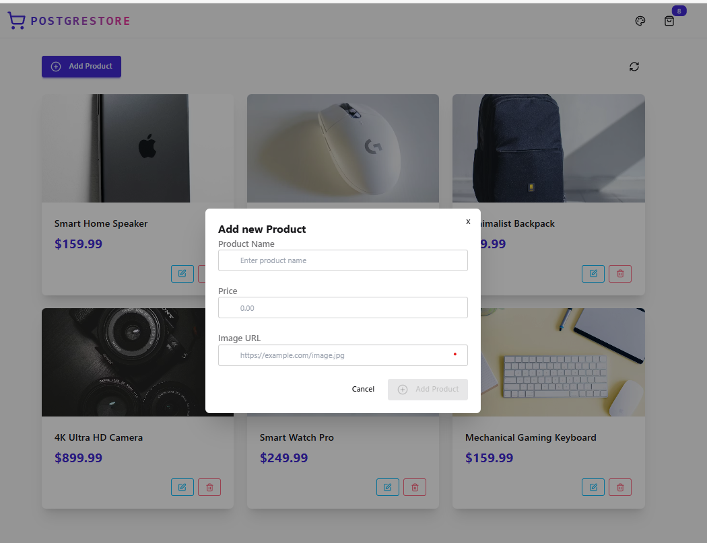
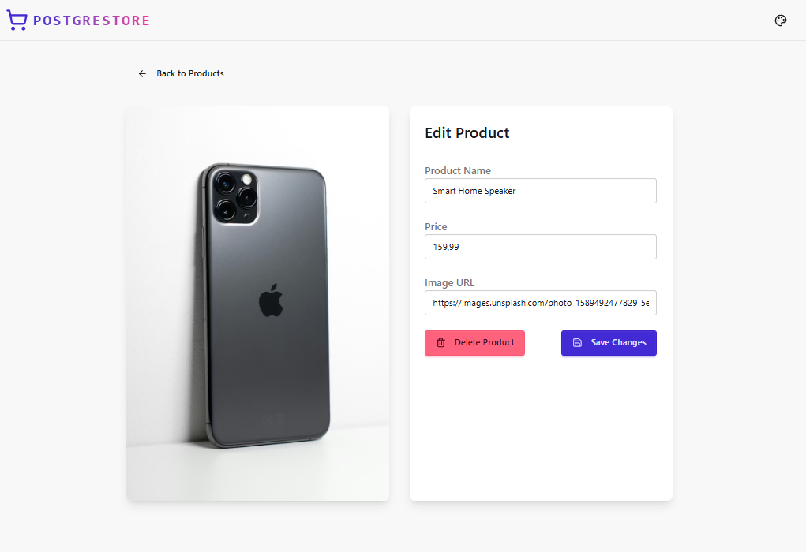

# 📦 PERN-PRODUCT Backend
Backend server for the **PERN-PRODUCT** application — a product management app built with the **PERN stack**. This project features a REST API, **NeonDB serverless** integration, and a lightweight frontend design.

The server handles full CRUD operations and connects to a PostgreSQL database hosted on NeonDB.

---

## 📸 Screenshots

| 🏠 Home Page | ➕ Add Product | ✏️ Edit Product |
| :---: | :---: | :---: |
|  |  |  |

---

---

## 🚀 Features
* **REST API:** Built with Node.js and Express.js.

* **Database:** PostgreSQL hosted on NeonDB (Serverless).

* **Product CRUD:** Full Create, Read, Update, and Delete capabilities.

* **CORS:** Enabled for seamless frontend-to-backend integration.

* **Frontend:** Basic HTML/CSS interface served via Express.

---

## 🛠️ Tech Stack

* **Runtime:** Node.js

* **Framework:** Express.js

* **Database:** PostgreSQL (NeonDB serverless)  

* **Frontend:** HTML5 / CSS3

* **Middleware:** CORS

---

## ⚙️ Environment Variables
Create a .env file in the root directory and add the following configuration:

PORT=5000
DATABASE_URL=your_neondb_connection_string_here

---

## 📦 Installation

### 1️⃣ Clone the Repository
```bash
git clone [https://github.com/HakanTole1/PERN-PRODUCT.git](https://github.com/HakanTole1/PERN-PRODUCT.git)
cd PERN-PRODUCT/backend
```
### 2️⃣ Install Dependencies
```bash
npm install
```
### 3️⃣ Set Up Environment Variables
Create a .env file in the root directory and add your NeonDB connection string.

### 4️⃣ Run the Server
```bash
npm run dev
The server will start on the port specified in your .env file (default is 5000).
```

---

## 📄 API Endpoints

| Method | Endpoint | Description |
| :--- | :--- | :--- |
| **GET** | `/api/products` | Get all products |
| **POST** | `/api/products` | Create a new product |
| **GET** | `/api/products/:id` | Get a product by ID |
| **PUT** | `/api/products/:id` | Update a product by ID |
| **DELETE** | `/api/products/:id` | Delete a product by ID |

---

## 🖥️ Frontend

> The project includes basic HTML and CSS files located in the `public/` folder. 

To start the frontend development server, run the following commands:

```bash
# Navigate to the frontend directory
cd ../frontend

# Install dependencies and start the app
npm install
npm run dev

---

## 🎓 Learning Credits & Acknowledgements

> [!TIP]
> **Reference:** This project was developed with a focus on **codesistency**.

A huge thanks to the **CODESİSTENCY** YouTube channel. They played a key role in helping me build this project. 🚀

---

## 📄 License & Credits
This project is for experimental and educational purposes.

